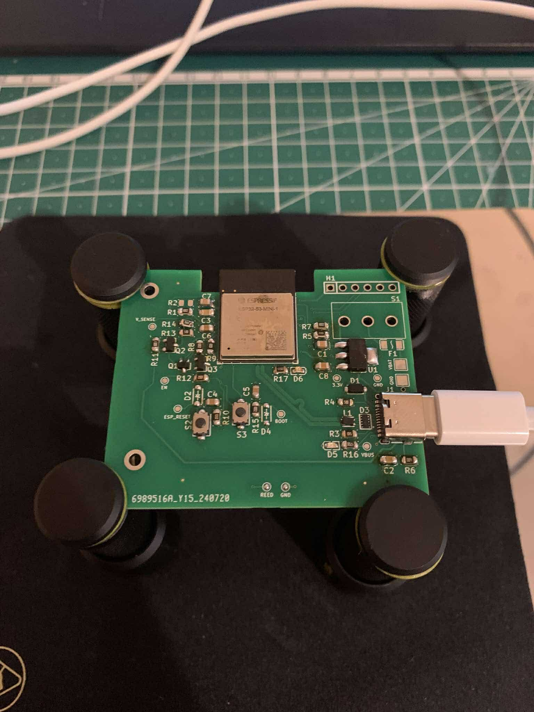
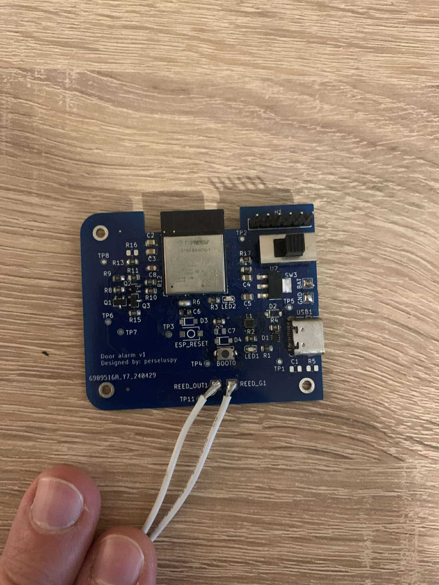

# Door alarm system
This project is a DIY smart door alarm system designed to enhance property security by providing real-time monitoring and notifications. The system detects whether a door has been opened or closed and instantly reacts to these events.

When a change is detected, the system transmits the event data through the local network to cloud services. The cloud then relays the information to a mobile application, alerting the property owner via a notification. This ensures the owner is promptly informed whenever someone enters or leaves the property.

*In case you are interested in making your own instance, please find the HW manufacturing files under the release tab.*

# How to build, flash and monitor the output the firmware
0. Check out the repository

1. Navigate to the `door_alarm_fw` directory:  
   ```bash
   cd door_alarm_fw
   ```

2. (Once) Build the Docker image by executing the following script if you have not done yet:  
   ```bash
   ./docker_build.sh
   ```

3. After the Docker image is successfully built, start the container using:  
   ```bash
   ./docker_start.sh
   ```

4. Configure the followings in *main.c* manually before build:

   ```c
   #define EXAMPLE_ESP_WIFI_SSID      "AP"
   #define EXAMPLE_ESP_WIFI_PASS      "password"

   #define EXAMPLE_STATIC_IP_ADDR        "192.168.0.100"
   #define EXAMPLE_STATIC_GW_ADDR        "192.168.0.1"
   #define EXAMPLE_STATIC_NETMASK_ADDR   "255.255.255.0"

   #define HOST "us-east-1-1.aws.cloud2.influxdata.com"
   #define PATH "/api/v2/write?orgID=[org_id]&bucket=[bucket_name]&precision=ns"
   #define TOKEN "Token [INFLUX_DB TOKEN]"
   ```

5. Inside the container, build the firmware by running:  
   ```bash
   ./build_firmware.sh
   ```

6. To program the firmware onto the device, use:  
   ```bash
   ./burn_firmware.sh
   ```

7. If you wish to observe the firmware's output, execute the monitoring script:  
   ```bash
   ./monitor_firmware.sh
   ```


## Release notes

### Version: v2.0
Changelog:
- Component library organised
- Fuse introduced
- IP4283CZ10-TBR,115 ESD diodes

### Version: v1.0
Changelog:
- USB capability (does not work)
- USB active LED (erroneously glows even when operating from battery)
- Debug programming header
- Reed switch gate 
- Debug LED
- Voltage sense

# Technical solutions
The heart of the device is the reed sensor, which operates in normally open mode (the circuit remains open when the magnet and the reed sensor are aligned). This design choice minimizes power consumption, as no current is drawn when the door is closed. The system remains in deep sleep mode most of the time and can only be interrupted by an interaction, such as opening or closing the door. When the system wakes up, it checks the battery charge level and the door status, then initializes the WiFi connection to transmit this data to the cloud. 

A time-series data platform, [Influx](https://cloud2.influxdata.com/signup), is used to collect the data, and the data is forwarded to [Grafana](https://grafana.com/) for visualization. You can find the `grafana_door_alarm_system.json` file in the docs, which you can import to create a dashboard for monitoring the door status and battery level. Make sure to set the source ID (UID) to ensure proper functionality. 

If you would like to receive notifications about state changes, I recommend visiting [IFTTT](https://ifttt.com/explore). You can trigger events and subscribe to them. The ideal solution is to create a webhook that can be triggered from the ESP32 when it wakes up. However, this is a PRO feature. If you want to stay within the free tier, you can create a Google Sheet, set it as a trigger, and add a row (GDrive API is enabled). When a row is added, the subscriber can receive a WhatsApp message (note that with the free plan, the message may be delayed up to 1 hour).


### V2
After the component placement, I realized that the voltage measurement enable pin pad came off, so I rewired it to the LED enable pin. As a result, every time I measure the battery level, the LED briefly lights up. I also didn't have a fuse in my inventory, so I bypassed it with a direct connection. Since USB communication was functioning properly, I decided not to add the H1 straight header pins.




**How to check if the USB interface is working properly:**

Run ```lsusb``` and look for a device called ```Espressif USB JTAG/serial debug unit``` 

```bash
root@c7cc3ff0b21c:/project# lsusb
Bus 004 Device 001: ID 1d6b:0003  
Bus 003 Device 003: ID 046d:c52b Logitech USB Receiver
Bus 003 Device 002: ID 13d3:54b1 Azurewave Integrated Camera
Bus 003 Device 021: ID 303a:1001 Espressif USB JTAG/serial debug unit
Bus 003 Device 004: ID 0bda:c123 Realtek Bluetooth Radio
Bus 003 Device 001: ID 1d6b:0002  
Bus 002 Device 001: ID 1d6b:0003  
Bus 001 Device 001: ID 1d6b:0002 
```

**A short code snippet (main.c, app_main()) that allows you to check if the general LED blinks:**
```c
const uint8_t led_en = GPIO_NUM_14;

void app_main(void)
{
    gpio_reset_pin(led_en);
    gpio_set_direction(led_en, GPIO_MODE_OUTPUT);

    while(1)
    {
        gpio_set_level(led_en, 1);
        vTaskDelay(pdMS_TO_TICKS(1000));
        gpio_set_level(led_en, 0);
        vTaskDelay(pdMS_TO_TICKS(1000));
    }   

    return;
}
```
In a short test, I approached the reed sensor with the magnet, which triggered a wake-up event (the LED lights up). While I held the magnet in place, nothing further happened, and the device went back to sleep. As soon as I removed the magnet, the LED flashed again, indicating that the system had woken up, similar to how it would behave if the door were opened. </br>


### V1
The first version was revised because the USB interface did not work at all, and it wasn’t even impedance-controlled. As a result, it had to be programmed via the UART interface using a USB-to-TTL adapter.



## Consumption calculations
Power usage estimates assume the application wakes up 6 times a day (3 times for door opening and 3 times for door closing), and the system is powered by 4 AA batteries with average capacity.

| **Component**              | **Current (µA)** | **Time (s)** | **Energy Contribution (µA·s)**   | **Comment**                                                                                          |
|----------------------------|------------------|--------------|-----------------------------------|------------------------------------------------------------------------------------------------------|
| AP2114HA-3.3TRG1           | 60              | 86400        | 60*86400 = 5184000  | LDO operates at all times.                                                                          |
| ESP32 awake doing its job  | 300000          | 60           | 300000*60 = 18000000| Wake-up duration is approximately 10 seconds.                                                      |
| Battery measurement        | 240             | 60           | 240*60 = 14400   | V_SENSE divider: ~ (6 V / 25000 Ω) = 240 µA, active only during wake-up periods.                    |
| Reed switch closed (door open)    | 330             | 45           | 330*45 = 14850      | The door is left open for a maximum of 15 seconds, and this state occurs during half of all activities. |
| ESP32 deep sleep mode      | 8               | 86340        | 8*86340 = 690720    | ESP32 consumes minimal power during deep sleep.                                                     |

#### Total Energy Contribution (µA·s):
$$
5184000 + 18000000 + 14400 + 14850 + 690720 = 23903970 \ \text{µAs}
$$

#### Average Current per day (µA):
$$
\text{Average Current} = \frac{23903970}{86400} \approx 276 \ \text{µA}
$$

**Assumptions:**
- **4 AA batteries** in series: Each AA battery provides **1.5V**, and the combined voltage will be **6V**.
- **Capacity of AA batteries**: We'll assume **2000 mAh** for typical alkaline AA batteries.
- **Average current consumption**: **276 µA** (0.276 mA).


Battery life in hours can be calculated by dividing the total battery capacity by the current draw:</br>
$$
\text{Battery Life (hours)} = \frac{\text{Battery Capacity (mAh)}}{\text{Current Consumption (mA)}}
$$
For **2000 mAh** batteries and **0.276 mA** current:
$$
\text{Battery Life (hours)} = \frac{2000}{0.276} \approx 7246 \, \text{hours}
$$
Convert this to days:
$$
\text{Battery Life (days)} = \frac{7246}{24} \approx 302 \, \text{days}
$$

**Calculation here is not final since batteries are not drained to 0 V.**
LDO shall be fed at least from 4V. 

## Limitations/what could be improved
- HW routing is not ideal
- Local wifi credentials and static IP as well as INFLUX_DB credentials must be compiled into the project and must be set from source code
- Consumptions increase when the door is open (around 400-500 uA)
- HW and FW project is tightly-coupled making versioning obscure
- Voltage divider resistors are mixed up
- Creation of a elegant enclosure is lacked

